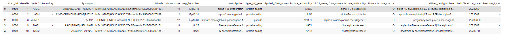
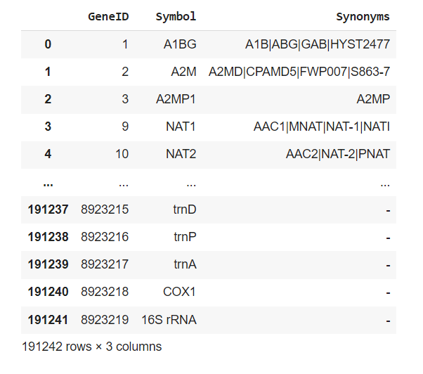
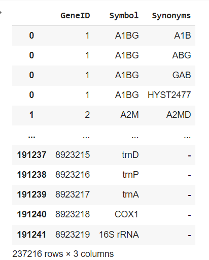
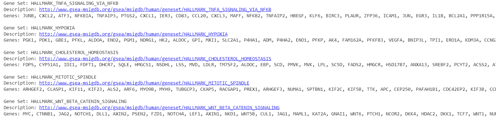
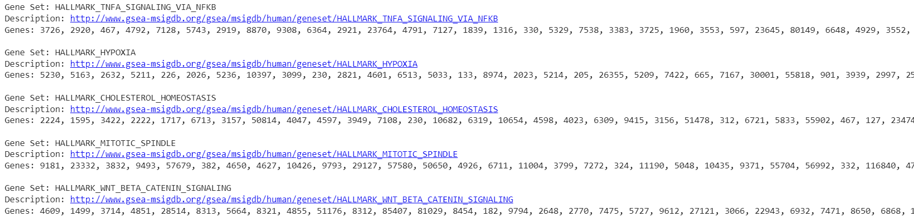

# Replacing  Gene names (or symbol) in the file with Entrez Ids 

This task is about to mapping of gene name to the associated geneID to h.all.v2023.1.Hs.symbols.gmt

## 1. Read "Homo_sapiens.gene_info.gz"

In the Homo_sapiens.gene_info.gz" we have mutliple features, but as per the per the requiremant of the task take 'GeneID', 'Symbol', 'Synonyms' were considered. for mapping. As 'Synonyms' having multiple values  seperated by '|' "Pipe" so explode the data make the 'Synonyms' of the same'Symbol' kept togeher. 

    Fig 1: Original Data

Select important columns and drop the remaining features

    Fig 2: Select specific columns

exploteded the synonyms in column wise

    Fig 3: Explode the columns

## 2. Read "h.all.v2023.1.Hs.symbols.gmt"

Read the "h.all.v2023.1.Hs.symbols.gmt" file, that contains Gene Set, Description and Genes.

    Fig 4: Read GMT file

## 3. Mapping of genes symbols with geneID

The  main requiremnt of the task is to convert Gene Symbols with the associateID present in the "Homo_sapiens.gene_info.gz" file. 

    Fig 5: Mapping output
    
## 4. Finaly the data is stored in gmt file name "mapping.gmt"